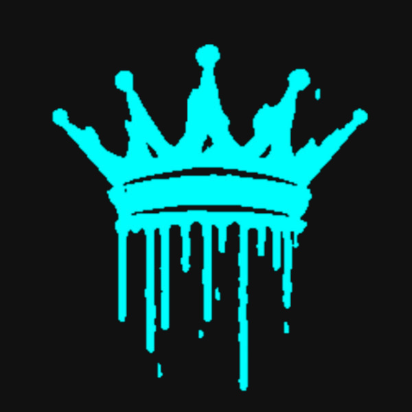

<table align="center">
  <tr>
    <td align="center">
      
    </td>
    <td align="center">
      <h1 style="margin: 0;">Kill3rKai</h1>
      Programmer
    </td>
  </tr>
</table>

  

---

## 🧠 About

Former competitive gaming content creator focused on  
**e-sports and tournament play**.

Stepped away when the scene shifted.  
Now building and playing **without pressure** —  
sometimes competitive, sometimes chill.

---

## Projects

  

> Repository contains project info — not source.

---

  no schedule · just programming

